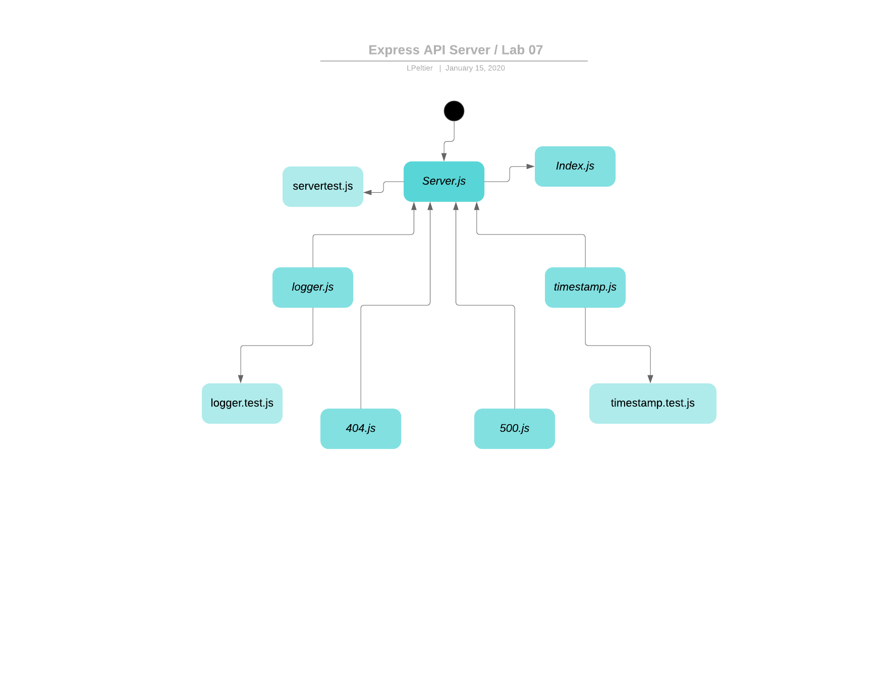

# Apprenti-401-Lab-07

## Express API Server

### Author: Lindsay Peltier

### Links and Resources

- [submission PR](https://github.com/LindsayPeltier-401-advanced-javascript/Apprenti-401-Lab-07/pull/1)
- [travis](https://www.travis-ci.com/LindsayPeltier-401-advanced-javascript/Apprenti-401-Lab-07/builds/144471334)

### Setup

#### How to initialize/run your server app (where applicable)

- `npm start`
- Endpoint: /docs

  - Returns JSdocs

#### Tests

- Unit Tests: `npm test`
- Lint Tests: `npm run lint`

#### UML

